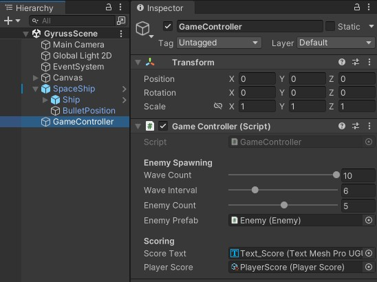
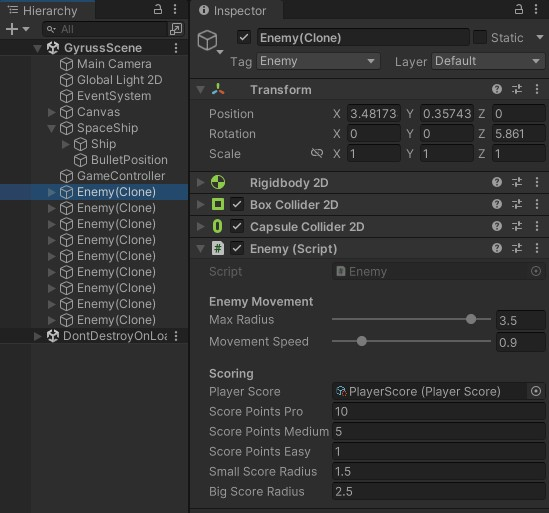

# Gyruss
A shoot 'em up arcade game from the 1980s ([Wikipedia](https://de.wikipedia.org/wiki/Gyruss)).  
Reference video on [YouTube](https://www.youtube.com/watch?v=8xV6HhsFGWc&ab_channel=Commodoremania).

## Background
This project was created as part of a test for a job application. The task was to prototype a gameplay mechanic in the game engine Unity and using C#. The goal was to develop a playable version of the core mechanic so that the game design team could evaluate it. Based on this prototype, additional elements such as graphics, sound, and animations were planned to be added later.

### Conditions
- The implementation should take no more than 8 hours.
- Free-to-use assets could be used (while respecting licensing restrictions). Alternatively, simple geometric shapes created in the Unity Editor were acceptable.

### Task
The project focuses on the following aspects:

**1. Player Controls**
- Create a playable ship entity, that moves in a circular path around the screen center.
- The player should be able to control the ship position on the circle.
- The player should be able to fire shots at the center of the circle.

**2. Enemy Spawning & Movement**
- Create a system that periodically spawns groups of enemies (e.g. in batches of 2 to 10).
- Enemies should move at a constant speed along a smaller circular path around the center.
- They should spawn at the center of the screen and gradually expand outward, increasing their movement diameter over time.

**3. Hit Detection & Scoring System**
- Make the player shots hit the enemies.
- Make the player gain a score. The smaller the diameter of the enemy that is being hit, the higher the score.

## Screenshots
### Game

### Unity
GameController:  

Enemy (prefab): Instantiated multiple times over time during gameplay  

SpaceShip (prefab)  

Bullet (prefab): Instantiated when the player shoots  

PlayerScore (scriptable object): Container that stores the current score and persists it permanently

 
